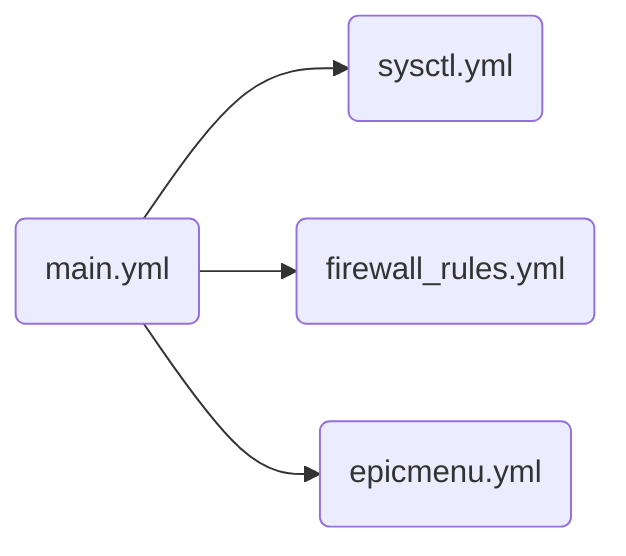

# Flow
  

```mermaid  
graph LR  
main.yml(main.yml) --> sysctl.yml(sysctl.yml)  
main.yml(main.yml) --> firewall_rules.yml(firewall_rules.yml)  
main.yml(main.yml) --> epicmenu.yml(epicmenu.yml)  
```